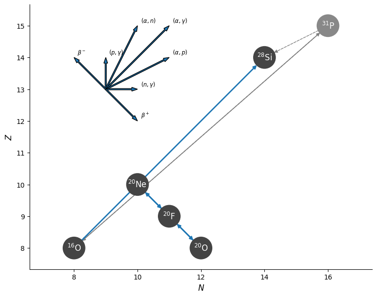

# Minilab 1: Place Your Bets: Explode or Implode?


## Introduction

Urca processes describe sets of reactions whereby isobars cyclically experience electron capture and $\beta$ decay (i.e. electron emission), both releasing neutrinos which stream freely away. [^GamowSchoenberg41] The net effect can lead to more efficient cooling that decreases thermal support to the point of collapse ("bankrupting" the star, hence the eponymous Casino de Urca in Rio de Jainero![^Haensel95]). 
Due to the varying dependencies of these reaction rates on temperature and density, the locations whereby the urca process dominate can be described by distinct shells. [^MartinezPinedo14]
<!-- Within these shells, $\beta$ decay produces local heating, while electron capture can either heat or cool the surrounding medium (dependent on density).-->

In the temperatures and densities characteristic of an accreting oxygen-neon (ONe) white dwarf, it is expected that these urca processes are critical to accurately modeling the expected end state of the star (implosion versus explosion).[^Hola26] To account for these processes, it is essential to carefully consider the nuclear network used throughout our models. 

In this lab, we will model the accretion stage of an ONe white dwarf, beginning from a precomputed starting point and evolving to oxygen ignition. To accomplish this, we will build a custom nuclear network and measure the rate balance between electron capture/$\beta^-$ decay rates. In the end, we will map the density at oxygen ignition to answer the question: Will this star explode or implode?

For more discussion on accretion-induced collapse in accreting white dwarfs, see also Schwab&Rocha19[^Schwab19], Schwab+15[^Schwab15], and Piersanti+22[^Piersanti22].


### Helpful Links

The general Google drive for these Wednesday labs can be found [HERE](https://drive.google.com/drive/folders/1OkVI_D5ilrETjjRzcqswcafA9bwROWfV?usp=drive_link). 

More specifically, the files for Lab 1 can be found [HERE](https://drive.google.com/drive/folders/1Pht6YvypYnXKGyDYzHVphCF7SZQ7MYAL?usp=drive_link). This drive contains the starting point, partial solutions (separated by task), and a full solution. You do **not** need to download the entire drive!

Lastly, it will be helpful to consult the [MESA documentation](https://docs.mesastar.org/en/latest/) throughout this lab.


## How to destroy a White Dwarf in 7(ish) easy steps!

Note throughout this lab expected tasks are outlayed specifically with: 
| 📋 TASK 0 |
|:--------|
| (insert stuff to do here) |

Additionally, there will be various
> [!WARNING]
> WARNINGS,

> [!NOTE]
> NOTES,


to help you along.


Values that need to be altered in the files will generally be marked with `!!!!!`, but feel free to look over the provided solutions if you get stuck!


### Step 0: Start Up

| 📋 TASK 1 |
|:--------|
| **Download** the starting point from the [Google Drive](https://drive.google.com/drive/folders/1Pht6YvypYnXKGyDYzHVphCF7SZQ7MYAL?usp=drive_link) to a local working directory. |

This starting point is a standard set of MESA files complete with a precomputed 1.1 M<sub>&#9737;</sub> Oxygen-Neon (ONe) white dwarf model.

After downloading, your working directory should look like:


  
    
    
    
    
    
    
    
    
    
    
    
    
      
      
    
  
 

At this stage, we are now ready to dive into some inlists!


### Step 1: Inlist

`inlist` serves as a direction point for the run, guiding the order and precedence of variables in various other inlist files. Given this, take a peak at `inlist`. What is the hierarchy of the provided inlists?

> [!NOTE]
> There is no task for this step! 


### Step 2: Inlist Common

`inlist_common` holds the set of "defaults" that we want to be common between various accretion runs. The primary point of this is to make changes to more modular. Instead of having to sort through walls of variables for each change, the core functionality can be stored in... common.

Now let's look over the file. You will notice that some variables have already been set to more aggressively relax tolerances and help the model converge at later times. Check the aside below **after** the lab for more details on particular choices in this file. [^Potekhin09] [^Itoh02] [^Jermyn21] [^Timmes00]



The work that will be done throughout this lab requires careful consideration of input physics for real science cases. Much of this has been smoothed over for the sake of brevity, as many of the necessary inputs would also scale up runtimes, but some important eos and coulomb correction details have been retained.

IN `&star_job`, we are using coulomb corrections from Potekhin+09 <sup id="fnref:Potekhin09"><a href="#fn:8" class="footnote-ref">8</a></sup>. for ions and Itoh+02<sup id="fnref:Itoh02"><a href="#fn:9" class="footnote-ref">9</a></sup> for electrons. These provide modifications to the ion and electron chemical potentials due to coulomb coupling and screening, respectively. In the ONe white dwarf regime of the these corrections become essential pieces on the rate and balance of URCA production. 

In `&eos`, the inlist is effectively forcing the use of the proper equation of state, Skye, throughout the core of the white dwarf, while dropping fidelity in the non-degenerate outer shell. The other eos options (PC, FreeEOS, and OPAL/SCVH) are explicitly deactivated, while dropping the mass fraction needed to consider an isotope in the Skye EOS. The means that in the portions of the star where Skye is not appropriate, MESA jumps down the order of precedence for EOS components directly to HELM, reducing runtimes. Note, the backstop eos, HELM, cannot be deactivated and (again) will still be the dominant eos in the outermost layers of non-degenerate accreted material (~5 km or ~0.4%). The explicit details of the Skye EOS and HELM EOS can be found in Jermyn+21 <sup id="fnref:Jermyn21"><a href="#fn:10" class="footnote-ref">10</a></sup> . and Timmes&Swesty00 <sup id="fnref:Timmes00"><a href="#fn:11" class="footnote-ref">11</a></sup>. 

In `&controls`, the inlist first **turns off** convective mixing entirely. This is purely a simplification to focus on where our URCA reactions take place, rather than dealing with the entire picture of convective URCA. Next, various smoothing options are set to 0. As for timesteps, the timestep size is doubled from the default and the tolerance for energy conservation made wider. The inlist also uses a larger mesh with cell sizes that preference refinement by q rather than temperature. For the solver, the use of eps_grav is motivated by the degenerate regime, where our entropy matter more than energy. The inlist also loosens many residual limits by **quite** a bit to ensure that the solver does not quit early or get caught trying to particularly resolve behavior too fine for the lesson in this lab. 

If you have extra time after the lab, feel free to take away some of the smoothing elements and explore which ones most effect the runtime on your device! More information on any particular option can also be found in the [MESA documentation](https://docs.mesastar.org/en/latest/)!



Throughout these labs, we will be loading in precomputed white dwarf models as starting points to avoid dealing with earlier stages of evolution. To improve the relevant accounting of our simulated accretion stages, it can be helpful to reset the initial age and initial model number of these models once read, making our runs look like fresh runs. Starting with the top of the file, reset the initial age, reset the initial model number, turn on pgstar, and save our final model as `ONE_1d-6`. 

| 📋 TASK 2 |
|:--------|
| In `&star_jobs`, **update `inlist_common`** to set initial age to 0, set initial model number to 0, turn on pgstar, and save our final model as `ONE_1d-6`. |



The parameters that should be updated/added are:
- `save_model_when_terminate`
- `save_model_filename`
- `set_initial_age`
- `initial_age`
- `set_initial_model_number`
- `initial_model_number`
- `pgstar_flag`




```fortran
! save a model at the end of the run
    save_model_when_terminate = .false. !!!!!
    save_model_filename = 'ONE_1d-6'    !!!!!

  ! initial model
    set_initial_age = .true. !!!!!
    initial_age = 0d0        !!!!!

    set_initial_model_number = .true. !!!!!
    initial_model_number = 0          !!!!!

  ! display on-screen plots
    pgstar_flag = .true.          !!!!!
    disable_pgstar_during_relax_flag = .false.
```


Next, we want to record the point of oxygen ignition in the white dwarf, but **DO NOT** want to try running through explosion/implosion during these labs. Set the maximum temperature of the model to 10<sup>9.1</sup> K (when the white dwarf begins to ignite oxygen). 

| 📋 TASK 3 |
|:--------|
| In `&controls`, **update `inlist_common`** to stop the model once temperature reaches 10<sup>9.1</sup> K |


The parameter that should be added is:
- `log_max_temp_upper_limit`




```fortran
! when to stop

     log_max_temp_upper_limit = 9.1d0 !!!!!
```


> [!WARNING]
> Don't forget to save your changes to the inlist!


### Step 3: Inlist Accrete

With the common variables set, now we can focus on the fun part: throwing material on the surface. We will control which reaction network is used and the material accreted within `inlist_accrete`. Unlike our previous inlist, this file has been provided mostly empty. 

Starting in `&star_jobs`, load in the downloaded model (`1.1Msun_ONe.mod`), change the initial network to a file we will later create called `ONe.net`, and set the weak rates to those of Suzuki+2016[^Suzuki16]. These Suzuki rates are critical for the treatment of degenerate O-Ne-Mg cores as these sd-shell electron capture and β-decay rates drive the URCA process. Without these rates, the weak reaction rates A=17 through A=28 isotopes would be interpolated with earlier weaklib tables that will not sufficiently resolve the cooling/heating features at the core of this lab. 


| 📋 TASK 4 |
|:--------|
| In `&star_jobs`, **update `inlist_accrete`** to load the `1.1Msun_ONe` model, change the initial nuclear network to `ONe.net`, and use the Suzuki rates.|

> [!NOTE]
> Remember, paths provided in the inlists are relative to the relevant `rn` executable. 


The parameters that should be added are:
- `load_saved_model`
- `load_model_filename`
- `change_initial_net`
- `new_net_name`
- `use_suzuki_weak_rates`



```fortran
  ! load previous model
    load_saved_model = .true.                   !!!!! 
    load_model_filename = '1.1Msun_ONe.mod'     !!!!!

  ! net
    change_initial_net = .true.  !!!!!
    new_net_name = 'ONe.net'     !!!!!

  ! weak rates
    use_suzuki_weak_rates = .true. !!!!!
```


Next, we want to accrete material of a given composition at a given rate. This material need not be the same composition as the surface star and may be defined as mass fractions of a variety of species. 

In `&controls`, set the accretion rate to 10<sup>-6</sup> M<sub>&#9737;</sub> / year of equal mass fractions of Oxygen-16 and Neon-20. Also, set the log output directory to a more descriptive name, `LOGS_ONe_1d-6`.


| 📋 TASK 5 |
|:--------|
| In `&controls`, **update `inlist_accrete`** to rename the LOGS directory to `LOGS_ONe_1d-6` and set the accretion rate to 10<sup>-6</sup> M<sub>&#9737;</sub> / year of equal mass fractions of Oxygen-16 and Neon-20. |

> [!NOTE]
> You will need to both explicitly stop MESA from accreting the same composition as the surface and flag that the new accretion composition will be given as mass fractions.

> [!NOTE]
> The isotope names are **case sensitive** and should be provided in lowercase!


The parameters that should be added are:
- `mass_change`
- `accrete_same_as_surface`
- `accrete_given_mass_fractions`
- `num_accretion_species`
- `accretion_species_id`
- `accretion_specia_xa`



The accretion of various species is primarily governed by two arrays: `accretion_species_id` and `accretion_specia_xa`. Additionally, `num_accretion_species` provides MESA with an expectation value for the lengths of these two arrays. 

The `id` of a particular species is defined through abbreviated isotopic hyphen notation (minus the hyphen) as [Chemical Symbol][Mass Number]. For example, Selenium-80 is se80 and Nickel-56 is ni56. More information on the variety of isotopes available in MESA can be found in `$MESA_DIR/chem/public/chem_def.f90`.

The `xa` is the mass fraction of the particular species, some decimal value less than or equal to 1. 

Therefore, if we wanted to accrete only Hydrogen-2, we would use:
```fortran
    ! Just H2
    num_accretion_species = 1
    accretion_species_id(1) = 'h2'
    accretion_species_xa(1) = 1d0 
```


> [!NOTE]
> Note, arrays in fortran are 1-indexed, so the first entry in an array is array(1) and the second is array(2). 


```fortran
  ! accretion

    mass_change = 1d-6                     !!!!!

    accrete_same_as_surface = .false.      !!!!!
    accrete_given_mass_fractions = .true.  !!!!!

    ! O and Ne
    num_accretion_species = 2
    accretion_species_id(1) = 'o16'  !!!!!
    accretion_species_xa(1) = 0.50d0 !!!!!
    accretion_species_id(2) = 'ne20' !!!!!
    accretion_species_xa(2) = 0.50d0 !!!!!

  ! output

    log_directory = 'LOGS_ONe_1d-6' !!!!!
```



> [!WARNING]
> Don't forget to save your changes to the inlist!


### Step 4: Building a Nuclear Network

As you may have guessed from our prior flags to change the initial net, MESA allows for the creation of custom reaction networks. The default net, `basic.net`, is a sufficient case for basic hydrogen and helium burning on the main sequence, but is insufficient outside of that regime or in more detailed nucleosynthesis studies. In general, the use of a particular network should be motivated by the physics that one seeks to explore traded against the additional computational time required on larger nets. Take a look over the format and structure of this default reaction network.

| 📋 TASK 6 |
|:--------|
| **Open `basic.net`**, peruse the included isotopes and reactions, and take note of the format. |

> [!NOTE]
> The reaction networks included in MESA can be found at `$MESA_DIR/data/net_data/nets/`


In pursuit of our central question, "implode or explode", the critical physics is whether our ONe white dwarf enters thermal runaway, producing an thermonuclear electron capture supernova (tECSNe), or collapses under its own gravity as a collapsing ECSNe (cECSNe).  This balance requires a nuclear network that accounts for the critical electron-capture (EC) chain Neon-20 -> Fluorine-20 -> Oxygen-20 and the burning of Oxygen-16 to Silicon-28. An overview of each of these reactions is below:
| Reaction                     | Equation                                                         |
|------------------------------|------------------------------------------------------------------|
| $EC$ : Ne-20 -> F-20      | $$\ce{^{20}_{10}Ne + e- -> ^{20}_{9}F + \nu_e}$$                 |
| $\beta^-$ : F-20  -> Ne-20   | $$\ce{^{20}_{9}F -> ^{20}_{10}Ne + e- + \bar{\nu}_e}$$           |
| $EC$ : F-20  -> O-20      | $$\ce{^{20}_{9}F + e- -> ^{20}_{8}O + \nu_e}$$                   |
| $\beta^-$ : O-20  -> F-20    | $$\ce{ ^{20}_{8}O -> ^{20}_{9}F + e- + \bar{\nu}_e}$$            |
| O-16 Burning                 | $$\ce{^{16}_{8}O + ^{16}_{8}O -> ^{28}_{14}Si + ^4_2\text{He}}$$ |

> [!NOTE]
> In MESA, "weak" denotes the weak reactions that lower nuclear charge, while "weak_minus" denotes the weak reactions that raise the nuclear charge. The rates we use will include the contributions of electron capture and positron emission or electron emission and positron capture as appropriate. The above table only uses EC and $\beta^-$ as a label for simplicity, as these contributions should be dominant in our degenerate regime. 

To implement this physics into our ONe white dwarf, start by creating the new `ONe.net` file in the working directory and adding the necessary isotopes.

Visually this network looks like:



The gray ${}^{31}\mathrm{P}$ nucleus is not explicitly carried in the network, but we include the link
${}^{16}\mathrm{O}({}^{16}\mathrm{O},p){}^{31}\mathrm{P}(p,\alpha){}^{28}\mathrm{Si}$ as an alternate
pathway to ${}^{16}\mathrm{O}({}^{16}\mathrm{O},\alpha){}^{28}\mathrm{Si}$ for oxygen burning (this
is included in the MESA rate we use.

| 📋 TASK 7 |
|:--------|
| **Create a new file `ONe.net`**, and **add the necessary isotopes** to encompass the reactions in the table above. |

> [!NOTE]
> You must also add Hydrogen to the mix! MESA **requires** all nuclear networks to contain both Hydrogen-1 and Helium-4. 


The isotopes that should be added are:
- Hydrogen-1 
- Helium-4
- Oxygen-16
- Neon-20 
- Fluorine-20
- Oxygen-20 
- Silicon-28



To add an a group of isotopes, use 
```fortran
add_isos(
    iso_i
    iso_ii
    ...
    iso_n
	)
```

Isotopes of the same element can either be written separately on new lines, or written on the same line with mass numbers separated by a space:
```fortran
!ie, for Zinc 64 and Zinc 66: 
zn64
zn66

! OR
zn 64 66
```



```fortran
!!!!! Add Isotopes
add_isos(
     h1
     he4
	 ! for Ne20 - F20 - O20
	 ne20
	 f20
	 o20
	 ! for O ignition
     o16
	 si28
	 )
```



With the isotopes added, we may now move to add specific reactions. Again, the consideration of reactions should depend on the physics in question. As previously mentioned, we only need to include the four $EC$/$\beta^-$ reactions and oxygen-16 burning, as described in the table. Add these reactions to `ONe.net`.

| 📋 TASK 8 |
|:--------|
| In `ONe.net`, **add the reactions from the table above**. |

> [!NOTE]
> Use the MESA documentation to find the `reaction_handle` (ie. reaction name) format for the standard 1-to-1 weak reactions.
> For oxygen burning, the `reaction_handle` can be found in `$MESA_DIR/data/rates_data/reactions.list`.


The following information can be found [here](https://docs.mesastar.org/en/latest/net/nets.html#description-of-net-format) under `reaction_handle`.

1-to-1 Z-decreasing reactions (positron emission or electron capture) between reactant x and product y follow the naming `r_x_wk_y`.

1-to-1 Z-increasing reactons (electron emission or positron capture) between reactant x and product y follow the naming `r_wk-minus_y`.

Note, x and y are the abbreviated isotope names (ie. Uranium-238 would be `u238`)



It is the first entry describing 2 Oxygen-16's turning into Helium-4 and Silicon-28. The correct line can be found by searching the file for `2 o16`. The `reaction_handle` is then in the first column.

Note, this `r1616` rate combines the *rates* of the $^{31}_{15}P$ and $^{28}_{14}Si$ product channels of oxygen burning, while only keeping one endpoint: $^{28}_{14}Si$ .



 - `r_ne20_wk_f20`
 - `r_f20_wk-minus_ne20`
 - `r_f20_wk_o20`
 - `r_o20_wk-minus_f20`



 - `r1616`



To add an a set of reactions, use 
```fortran
add_reactions(
	reaction_i
	reaction_ii
	...
	reaction_n
	)
```



```fortran
!!!!! Add Reactions
add_reactions(
	! for oxygen ignition
	r1616

	! for Ne20 - F20 - O20
	r_ne20_wk_f20
	r_f20_wk-minus_ne20
	r_f20_wk_o20
	r_o20_wk-minus_f20
	)
```


> [!WARNING]
> Don't forget to save your changes!


### Step 5: History/Profile Columns

The provided `history_columns.list` and `profile_columns.list` have both already been updated for this lab. In particular, the following values have been added to the history columns output in place of their shortform defaults (where center is abbreviated to cntr):
- `log_center_T`
- `log_center_Rho`
- `log_center_P`

The following profile column outputs have been added to provide information about our net:
- `add_eps_nuc_rates` : Nuclear energy minus neutrino losses for each reaction in network
- `add_eps_neu_rates` : Neutrino losses for each reaction in network
- `add_log_abundances` : Log of abundances for each isotope in network

> [!NOTE]
> There is no task for this step! 


### Step 6: Inlist Pgstar

Within the white dwarf interior, there should be some preference for electron capture (EC) over electron emission ($\beta^-$) as the "free" electron levels fill up with increasing density. Therefore, the rate of Ne-20 -> F-20 ($\lambda_{^{20}Ne->^{20}F}$) should be higher than the rate of F-20 -> Ne-20 ($\lambda_{^{20}F->^{20}Ne}$) at high densities.

The provided `inlist_pgstar` has been mostly pre-formatted to show exactly this, given some values to be created in `run_star_extras.f90`. Set `profile_panels1_yaxis_name(1)` to `lambda_ne20_f20` and `profile_panels1_other_yaxis_name(1)` to `lambda_f20_ne20`.

| 📋 TASK 9 |
|:--------|
| In `inlist_pgstar`, **Set** `profile_panels1_yaxis_name(1)` to `lambda_ne20_f20` and `profile_panels1_other_yaxis_name(1)` to `lambda_f20_ne20`   |


```fortran
profile_panels1_yaxis_name(1) = 'lambda_ne20_f20' !!!!!
profile_panels1_yaxis_log(1) = .true.
profile_panels1_ymin(1) = -40d0
profile_panels1_ymax(1) = 5d0

profile_panels1_other_yaxis_name(1) = 'lambda_f20_ne20' !!!!!
profile_panels1_other_yaxis_log(1) = .true.
profile_panels1_other_ymin(1) = -40d0
profile_panels1_other_ymax(1) = 5d0
```



> [!NOTE]
> With these inclusions, the provided `inlist_pgstar` will now be expecting two new profile columns: `lambda_ne20_f20`, `lambda_f20_ne20`

> [!WARNING]
> Don't forget to save your changes!


### Step 7: Run Star Extras

Now that `inlist_pgstar` is expecting these two new profile columns, let's try making them with `run_star_extras.f90`! 

Thankfully, most of the work has already been done for this lambda computation using a variety of prebuilt functions available in MESA. In particular, the script makes use a new data type, `Coulomb_Info`, and four functions: `get_weak_rate_id`, `eosDT_get`, `coulomb_set_context`, `eval_weak_reaction_info`. These are all defined within modules found in `$MESA_DIR/rates/public/` and `$MESA_DIR/eos/public/`. Generally, these public subdirectories provide swaths of tools used throughout MESA that may be called within `run_star_extras`. In order to use these functions, we must first add them to the local scope of `run_star_extras`. 

| 📋 TASK 10 |
|:--------|
| In `src/run_star_extras.f90`, **bulk import** the new submodules (`rates_lib`, `eos_lib`, and `eos_def`) and **selectively import** `Coulomb_Info` from `rates_def`.  |

> [!NOTE]
> If you are unfamiliar with Fortran, see Georgia Tech's [Aerospace Engineering Resource page for Fortran90](https://aeresources.gatech.edu/Fortran/Webpage/) which compiles information on Frotran types/modules/loops/etc at an undergraduate level

> [!NOTE]
> These module names are the base name of the file which contains the necessary function. For instance, the `eval_weak_reaction_info` subroutine is defined in the file `$MESA_DIR/rates/public/rates_lib.f90`, hence the necessary module is `rates_lib`.


```fortran
use module
```



```fortran
use module, only: some_module_entity
```



```fortran
! Import new modules
use rates_lib
use rates_def, only: Coulomb_info
use eos_lib
use eos_def
```


With the needed functions in scope, we now need to set the number of new profile columns. 

| 📋 TASK 11 |
|:--------|
| In `src/run_star_extras.f90`, **set** number of extra profile columns to 2. |


Look for the variable `how_many_extra_profile_columns` within the function of the same name



```fortran
integer function how_many_extra_profile_columns(id)
         integer, intent(in) :: id
         integer :: ierr
         type (star_info), pointer :: s
         ierr = 0
         call star_ptr(id, s, ierr)
         if (ierr /= 0) return
         how_many_extra_profile_columns = 2 !!!!!
      end function how_many_extra_profile_columns
```


Now, we can add new data to these profile columns in `data_for_extra_profile_columns`. 

Starting at the top of the subroutine, the set of necessary pointers, arrays, doubles, and integers are defined for use following the standard boilerplate seen in other MESA subroutines. Next, the names of the new profile columns need to be set to match the values expected in `inlist_pgstar` and the names of the product/reactant species for each of the reactions need to be identified explicitly. 

| 📋 TASK 12 |
|:--------|
| In `src/run_star_extras.f90`, **set** the new profile names to `lambda_ne20_f20` and `lambda_f20_ne20`. Then, **set** `weak_lhs` and `weak_rhs` to the reactant (left-hand side) species name and product (right-hand side) species name for each reaction. |

> [!NOTE]
> The species name is the abbreviated isotopic name (ie. Helium-4 is he4).


If we wanted to look at lambda_c14_n14, then we would set
```fortran
name(1) = 'lambda_c14_n14'
weak_lhs(1) = 'c14'
weak_rhs(2) = 'n14'
```



```fortran
! Set names for new profile columns
names(1) = 'lambda_ne20_f20' !!!!!
names(2) = 'lambda_f20_ne20' !!!!!

! Set the names of species on the left and right hand side for each of the new profile columns
! ie. weak_lhs(1) corresponds to the reactant (left-hand) species for names(1) and weak_lhs(2) corresponds to the reactant (left-hand) species for names(2)
weak_lhs(1) = 'ne20' !!!!!
weak_rhs(1) = 'f20'  !!!!!

weak_lhs(2) = 'f20'  !!!!!
weak_rhs(2) = 'ne20' !!!!!
```


Using these values, the script then will allocate the necessary arrays and gather the relevant id for each reaction. Next, for each zone within the model, the script solves for lambda (click the aside below for more information when you have time after the lab). Within this loop, save the lambda value into the vals array for each reaction.



In a fairly broad description, the code is looping through every zone of the star starting at the outermost portion (k = 1). At each step, we first make a call to explicitly evaluate the equation of state at that zone. This includes local values of things like temperature, pressure, and electron chemical potential along with their derivatives. Next, a relevant `Coulomb_Info` structure is set to hold the necessary set of local values used in the calculation of coulomb corrections and populated. Finally, the capture rates for each reaction are evaluated. This evaluation populates values at a set of pointers for our use including lambda, Q (total thermal energy), and Qneu (thermal energy going to neutrinos).  Most of these pointers are being ignored in this particular lab.



| 📋 TASK 13 |
|:--------|
| In `src/run_star_extras.f90`, **fill** `vals` with the value of lambda for each reaction within a `do` loop|

> [!NOTE]
> This new `do` loop should be created *within* the loop over zones. 

> [!NOTE]
> The value of lambda is stored in `lambda(i)` for reaction i. 


```fortran
do i = minimum, maximum 
   x = y
end do
```



`i` should range from 1 to the number of reactions, `nr`



`vals` has form (zone_i, val_i). 

Therefore, over each loop on zone `k`, we should expect to save a value for `lambda(i)` at `vals(k,i)` where `i` is the reaction index ranging from 1 to the number of reactions (`nr`).



```fortran
! save results to the new profile column arrays
! Note, vals takes entries as (nz_i, profile_column_i)
!!!!!
do i = 1, nr
   vals(k,i) = lambda(i)
end do
!!!!!
```



> [!WARNING]
> Don't forget to save your changes to run_star_extras!

### Step 8: Run the Model!

With all the inlists complete, we can finally answer the age old question: **Will this thing blow up?**

| 📋 TASK 14 |
|:--------|
| **Run** the model! Observe the behavior and evolution of the star up to oxygen ignition. Does the balance of lambda values make sense? Does the crossing point agree with Figure 4 from Pinedo+14[^MartinezPinedo14] (below)? |

*Figure 4, from Pinedo+14: Electron capture and beta decay rates on $\ce{^{20}Ne<->^{20}F}$ with and without screening. Top panel log(T[K]) = 8.6. Bottom panel log(T[K]) = 9.0* [^MartinezPinedo14]


> [!IMPORTANT]
> Do not forget to `./clean`, then `./mk`, then `./rn`

> [!NOTE]
> If you want to look at the final pgplot longer, try adding `pause_before_terminate = .true.` into the `&star_jobs` section of `inlist_common`. 


Note: This gif stacks both the pgstar plots, but they will be separate during the run!





Yes! Broadly, we should expect $\lambda_{^{20}Ne->^{20}F}$ to be greater than $\lambda_{^{20}F->^{20}Ne}$ at high densities due to the effects of pauli blocking. At lower densities, the opposite should be true as $^{20}F$ spontaneously decays without enough energy to do electron capture on $^{20}Ne$.

Further, the crossing point of the two curves generally agrees with the work of Pinedo+14 when looking at the values in the associated profile columns (or by eye). The profile columns provide a crossing point at log($\rho$) ~ 9.86 and log(T)~8.9. With a simple interpolation on the two panels of figure 4 from Pinedo+14, we can suspect that with log(T)~8.9, this matches the crossing point. (Note: Ye = 0.5 for our ONe white dwarf)

Final lambda plot:



| 📋 TASK 15 |
|:--------|
| **Review** the central density of the model at ignition by looking at the pgstar plot or in `profile.data`. Using this value and Figure 8 from Holas+26[^Holas26] (below), assuming that ignition is perfectly centered, does your model explode or implode? What if you use the radius of ignition given from the profile? Does the assumption of wave speed or radius of ignition change the result? |

*Figure 8, from Holas+26: Outcomes of 3D hydrodynamic simulations by ignition location and central density at ignition. The dashed and dotted lines indicate the transition from explosion to collapse for the TW92 and S20 flame speeds, respectively.* [^Holas26]


Yes! The central density at ignition should be ~ $10^{9.924}$ cgs. This is firmly within the purely explosive regime below ~ $10^{9.97}$ cgs for any radius or flame speed. Looking to the profile columns, the peak temperature does not occur in the center, but at a radius of ~ 65 km, making the required densities for collapse much greater. Despite choices of flame speed and the degree to which the ignition location is off-center, these 3D simulations suggest that our model would have exploded. 


Of course, there are a number of caveats in that the MESA models in this lab are just toy models with quite a bit of softening to reduce runtimes. This necessarily changes the physics in question alongside the massively reduced nuclear network used in this lab. 



## BONUS: What about our other weak rate?

If you have time, try to gather the same information about the lambda balance for $\ce{^{20}F<->^{20}O}$. To implement this, try extending the `run_star_extras` code! Don't forget to replace/reformat the `eps_nuc_neu_total` and `non_nuc_neu` plots in `inlist_pgstar`, to see all of them together. Does there appear to be any relation to temperature?

> [!NOTE]
> The relevant arrays can all be extended trivially for this case, but don't forget to increase the integer value of `nr`!


Yes, there is a relationship to temperature! At sufficiently high temperature, the rate of beta decay begins to increase again with contributions from forbidden transitions and a reduction in pauli blocking. 





## References
[^Suzuki16]: Suzuki, Toshio, Hiroshi Toki, and Ken’ichi Nomoto. "Electron-capture and β-decay rates for sd-shell nuclei in stellar environments relevant to high-density O–Ne–Mg cores." The Astrophysical Journal 817, no. 2 (2016): 163. https://iopscience.iop.org/article/10.3847/0004-637X/817/2/163.
[^Hola26]: Holas, Alexander, Samuel W. Jones, Friedrich K. Röpke, Rüdiger Pakmor, Christina Fakiola, Giovanni Leidi, Raphael Hirschi, and Ken J. Shen. "Drawing the line between explosion and collapse in electron-capture supernovae." (2026). https://www.aanda.org/articles/aa/pdf/2026/03/aa57910-25.pdf.
[^MartinezPinedo14]: Martínez-Pinedo, G., Y. H. Lam, K. Langanke, R. G. T. Zegers, and C. Sullivan. "Astrophysical weak-interaction rates for selected A= 20 and A= 24 nuclei." Physical Review C 89, no. 4 (2014): 045806. https://journals.aps.org/prc/pdf/10.1103/PhysRevC.89.045806
[^Jermyn21]: Jermyn, Adam S., Josiah Schwab, Evan Bauer, F. X. Timmes, and Alexander Y. Potekhin. "Skye: A differentiable equation of state." The Astrophysical Journal 913, no. 1 (2021): 72. https://iopscience.iop.org/article/10.3847/1538-4357/abf48e/meta
[^Timmes00]: Timmes, Frank X., and F. Douglas Swesty. "The accuracy, consistency, and speed of an electron-positron equation of state based on table interpolation of the Helmholtz free energy." The Astrophysical Journal Supplement Series 126, no. 2 (2000): 501-516. https://iopscience.iop.org/article/10.1086/313304/meta
[^Potekhin09]: Potekhin, Alexander Y., Gilles Chabrier, and Forrest J. Rogers. "Equation of state of classical Coulomb plasma mixtures." Physical Review E—Statistical, Nonlinear, and Soft Matter Physics 79, no. 1 (2009): 016411. https://journals.aps.org/pre/abstract/10.1103/PhysRevE.79.016411
[^Itoh02]: Itoh, Naoki, Nami Tomizawa, Masaya Tamamura, Shinya Wanajo, and Satoshi Nozawa. "Screening corrections to the electron capture rates in dense stars by the relativistically degenerate electron liquid." The Astrophysical Journal 579, no. 1 (2002): 380-385. https://iopscience.iop.org/article/10.1086/342726/meta
[^Haensel95]: Haensel, Paweł. "Urca processes in dense matter and neutron star cooling." Space Science Reviews 74, no. 3 (1995): 427-436. https://ui.adsabs.harvard.edu/scan/manifest/1995SSRv...74..427H
[^GamowSchoenberg41]: Gamow, George, and Mario Schoenberg. "Neutrino theory of stellar collapse." Physical Review 59, no. 7 (1941): 539. https://journals.aps.org/pr/abstract/10.1103/PhysRev.59.539
[^Piersanti22]: Piersanti, Luciano, Eduardo Bravo, Oscar Straniero, Sergio Cristallo, and Inmaculada Domínguez. "Pre-explosive accretion and simmering phases of SNe Ia." The Astrophysical Journal 926, no. 1 (2022): 103. https://iopscience.iop.org/article/10.3847/1538-4357/ac403b/meta
[^Schwab15]: Schwab, Josiah, Eliot Quataert, and Lars Bildsten. "Thermal runaway during the evolution of ONeMg cores towards accretion-induced collapse." Monthly Notices of the Royal Astronomical Society 453, no. 2 (2015): 1910-1927. https://academic.oup.com/mnras/article/453/2/1910/1153861?guestAccessKey=
[^Schwab19]: Schwab, Josiah, and Kyle Akira Rocha. "Residual carbon in oxygen–neon white dwarfs and its implications for accretion-induced collapse." The Astrophysical Journal 872, no. 2 (2019): 131. https://iopscience.iop.org/article/10.3847/1538-4357/aaffdc/meta


